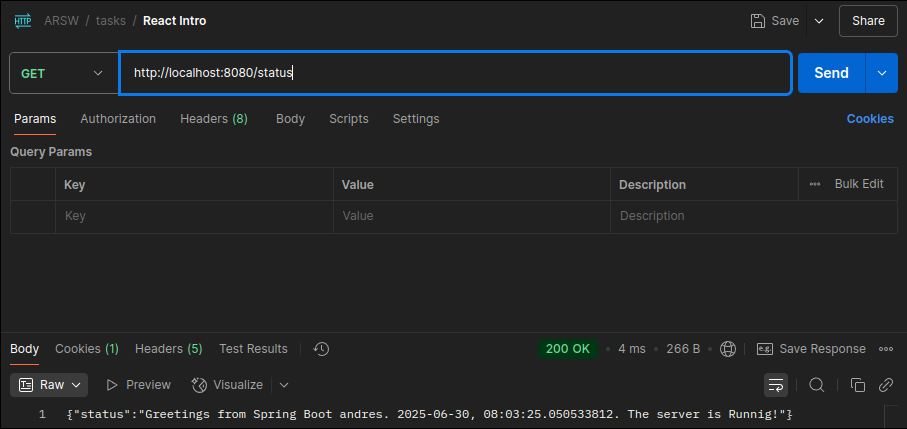
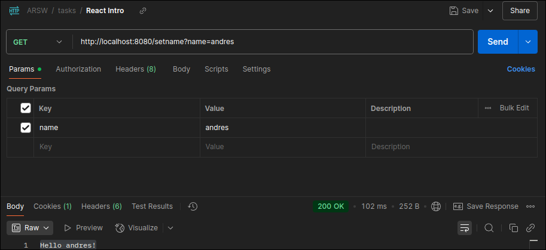

<div align="center">
    <h1 align="center">Introduction React</h1>
    <p align="center">
A MVC project that serves a web component built with React. The component displays the current time fetched from a backend endpoint.
    </p>
</div>

</br>

## Description

This project demonstrates how to integrate a React frontend with a Spring Boot backend using an MVC architecture. The application serves a simple React component that consumes a REST API to display real-time data. The primary function is to fetch the current server time from an endpoint and render it. It also includes an optional feature to configure a user's name via another endpoint.


</br>

## Features ✨

- A full-stack application using Spring Boot for the backend and React for the frontend.
- Serves a React component from a Spring Boot controller.
- Displays real-time server time by consuming a self-hosted REST endpoint.
- Allows configuration of a display name through a POST request.

</br>
</br>

## Getting Started 🚀

Follow these steps to get the project running on your local development environment.

Installation

```sh
git clone https://github.com/Andr3xDev/ARSW-IntroReact.git
```

Build the project and install dependencies using Maven. This will also build the React frontend.

```sh
cd ARSW-IntroReact
mvn clean verify
```

Run the Spring Boot application.

```sh
mvn spring-boot:run
```

The application will be available at http://localhost:8080.

</br>
</br>

## API Endpoints 🔌

The React component interacts with the following endpoints provided by the Spring Boot application:

### Get Status/Time

This endpoint is used to fetch the current server time.

- URL: /status
- Method: GET
- Success Response (200 OK):

```json
{
  "time": "{"status":"Greetings from Spring Boot <name>. 2025-06-30, 08:03:25.050533812. The server is Runnig!"}"
}
```





### Configure Name (Optional)

This endpoint sets the name to be displayed on the screen.

- URL: [Add your endpoint URL here, e.g., /api/user]
- Method: POST
- Request param: name:<String>

```
{
  "status": "success",
  "newName": "Andrés"
}
```


